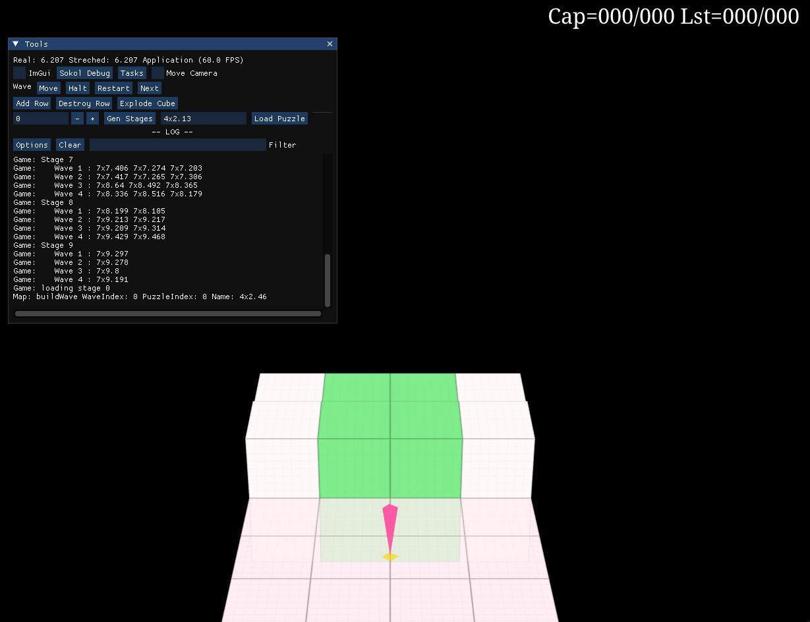

# hIghQube
Kurushi like game

https://github.com/RuiVarela/hIghQube/assets/11543973/07e27d90-5b3b-4edc-a19d-4ff38d844c6d



# Controls
- Movement - ASDW
- SpeedUp - J
- Pick / Trigger - K
- Trigger Advantage Cube - I

## Features
- Cross platform renderer based on [sokol](https://github.com/floooh/sokol)
- A big chunk of kurushi gameplay implemented
- Level switching is implemented
- A lot of [levels](https://iq.airesoft.co.uk/) 
- A debug ui based on [imgui](https://github.com/ocornut/imgui)

## TODO:
- Scoring
- Cube acceleration should move camera to the end
- Add / remove row when puzzle end 
- Detect player crush
- Detect fall off stage
- Detect "Perfect"
- General Rules
- All Audio is missing

## Development
```bash
git clone git@github.com:RuiVarela/hIghQube.git
cd hIghQube

git submodule init
git submodule update

#
# Windows macOS
#
mkdir build
cd build
cmake ..

cmake --build .

#
# iOS
#
mkdir build_ios
cd build_ios
cmake .. -G Xcode -DCMAKE_SYSTEM_NAME=iOS
open hIghQube.xcodeproj 

#
# Android
#
# use Android Studio
```

## Helper Commands

# add vendor submodule
```zsh
git submodule add git@github.com:memononen/fontstash.git vendor/fontstash
git config -f .gitmodules submodule.vendor/fontstash.shallow true
```

# generate apple icns
```zsh
mkdir app.iconset
sips -z 16 16 icon.png --out app.iconset/icon_16x16.png
sips -z 32 32 icon.png --out app.iconset/icon_16x16@2x.png
sips -z 32 32 icon.png --out app.iconset/icon_32x32.png
sips -z 64 64 icon.png --out app.iconset/icon_32x32@2x.png
sips -z 128 128 icon.png --out app.iconset/icon_128x128.png
sips -z 256 256 icon.png --out app.iconset/icon_128x128@2x.png
sips -z 256 256 icon.png --out app.iconset/icon_256x256.png
sips -z 512 512 icon.png --out app.iconset/icon_256x256@2x.png
sips -z 512 512 icon.png --out app.iconset/icon_512x512.png
cp icon.png app.iconset/icon_512x512@2x.png
iconutil -c icns app.iconset
rm -R app.iconset
```

# generate ico
```zsh
# sizes=(16x16 32x32 128x128 256x256 512x512 1024x1024)
sizes=(32x32 128x128 256x256)
mkdir ico 
files=""
for size in "${sizes[@]}"; do
    file="ico/${size}.png"
    files="$files $file"
    convert icon.png -quality 100 -resize $size $file
done
files=$(echo $files | sed -e 's/^[[:space:]]*//' -e 's/[[:space:]]*$//')
convert ${(z)files} app.ico 
rm -R ico
```

# compile shaders
```zsh
vendor/sokol-tools-bin/bin/osx/sokol-shdc \
    --input src/render/VisualRenderer.glsl \
    --output src/render/VisualRenderer.glsl.h \
    --slang hlsl5:metal_macos:metal_ios:metal_sim:glsl300es
```
```powershell
.\vendor\sokol-tools-bin\bin\win32\sokol-shdc.exe `
    --input src/render/VisualRenderer.glsl `
    --output src/render/VisualRenderer.glsl.h `
    --slang hlsl5:metal_macos:metal_ios:metal_sim:glsl300es
```

# generate a gif from video
```zsh
ffmpeg -i Untitled.mov -filter_complex "[0:v] fps=6,scale=480:-1,split [a][b];[a] palettegen [p];[b][p] paletteuse" dump.gif
``` 
